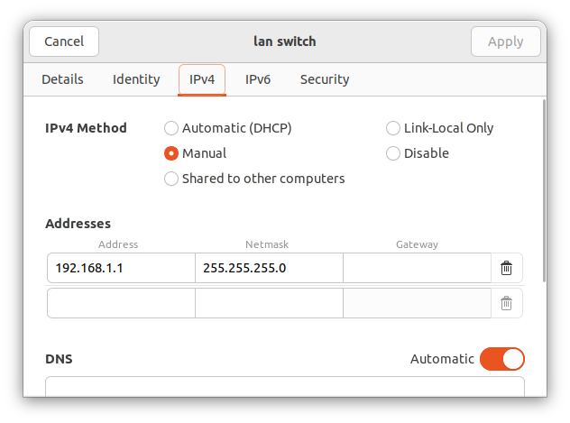
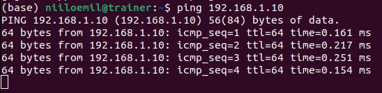

# Real-World Push-T 

[[Github Project]](example.com)
[[Data]](example.com)
[[Videos]](example.com)

The code and this readme-file are modified from from [Diffusion policy](https://github.com/real-stanford/diffusion_policy).
Our major contributions can be summarized (but is not limited to) as sensor intergration, actuator intergration, push-T scripting, and control configs.

README v0: [Niilo Emil Isosomppi](example.com) 07.02.2024\
README v1:


## 💾 Installation
<details>
<summary>Full installation code.</summary>
Run the following:
<a>

```console
TODO
```
</a>
</details>

To reproduce our environment, install the given conda environment on a Linux machine with an Nvidia RTX 3090 GPU. 

The author of this tutorial tried using <span style="color:ff5733"> Conda </span> but was unable to. While <span style="color:ff5733
"> Mambaforge </span> is discouraged by its authors as of September 2023, it is what has been tested in the lab. For future users of the setup, it may be worthwhile upgrading to <span style="color:ff5733
"> Miniforge </span>.

[Mambaforge](https://github.com/conda-forge/miniforge#mambaforge) installation: 

It is assumed that you have already agreed to the licence when running with the flag -b. In terminal:

```console
cd ~
wget https://github.com/conda-forge/miniforge/releases/latest/download/Mambaforge-Linux-x86_64.sh
bash Mambaforge-Linux-x86_64.sh -b
~/mambaforge/bin/conda init bash
source ~/.bashrc
```

(OPTIONAL): Remove the huge ASCII art banner that comes up with every mamba command run:
```console
mamba env config vars set MAMBA_NO_BANNER=1
source ~/.bashrc
```


Unlike in simulation, you will not need the Mujoco dependencies.
You will need the dependencies for Spacemouse:
```console
sudo apt install libspnav-dev spacenavd; sudo systemctl start spacenavd
```
We will need cmake:
```console
sudo apt-get -y install cmake
sudo apt-get install build-essential
```

```console
pip install --upgrade pip
pip install --upgrade setuptools
```

The following env creation took around 10 minutes for the author of this document. 
(OPTIONAL): Get a coffee while it runs.
```console
cd ~/Documents/GitHub/diffusion_policy_mtplab
mamba env create -f conda_environment_real.yaml
conda activate rd
```
## 🔌 Components to connect 

The Realsense cameras should be connected to the PC via USB (3.1) cable.

Connect the PC to the ethernet switch.

Be sure to power the switch, the PSU, and the CB3 for UR10.

Turn the Key Light on (mode I).

If you are going to use the suction cup, ensure that the Arduino Nano is plugged to the computer via USB cable. Additionally, ensure that the 8mm tube connected to the solenoid valve is plugged into the compressed air supply in the wall, the wall valve is open, and the pressure reads 5bar. 

## 💾 Robot setup
<span style="color:ff5733"> Warning: </span>\
Joint limits for the robot are <span style="color:ff5733"> not </span> configured in the teach pendant, but in Python. Futhermore, these currently only exist when using teleop or when running model inference. Exercise caution if programming new hard-coded movements. Especially, beware of generating linear movements using moveL around the wrist singularity (when joint 5 is a multiple of ±180°). Doing this will likely break the end-effector. Replacement parts can be printed as documented in section [🛠️Replacement parts](###🛠️-replacement-parts).

To connect the robot to the computer, make sure they are connected. Both should be connected to the ethernet switch via cable. Create an ethernet network rule on the computer which has the IP address `192.168.1.1`. It should look like this:



You can verify that the network rule is working by entering 192.168.1.13 into your web browser. This is the web interface for the FT sensor, which you should be able to connect to if the network is configured correctly. 

The PC can be connected to the internet via wifi. Do not connect the switch directly to the university network. Per my understanding, the university does not appreciate it if you do this.

Turn the robot's teach pendant on.

Verify that the robot's network settings panel looks like this, with an IP address `192.168.1.10`


In the teach pendant, verify that in `program robot` -> `installation`:

    MODBUS client IO setup is OFF (contains no elements)
    Ethernet/IP adapter is OFF
    POROFINET IO device is OFF

## 🛜 Network

| Device     | Address      |
|------------|--------------|
| PC         | 192.168.1.1  |
| UR10 CB3   | 192.168.1.10 |
| 2F gripper | 192.168.1.12 |
| FT sensor  | 192.168.1.13 |

These should be pingable: 


## 🦾 Demo, Training and Eval on a Real Robot
Initialize and start the robot from the teach pendant, making sure that the payload is set to 2.18kg (emergency stop button within reach at all time), your cameras plugged in to your workstation (tested with `test_multi_realsense.py`) and your SpaceMouse connected with the `spacenavd` daemon running (verify with `systemctl status spacenavd`).

Create a folder for your data:
```console
cd ~/Documents/GitHub/diffusion_policy_mtplab
mkdir data
```

Demonstration datasets arr provided and is made available on the user "Trainer" on the lab computer. A physical copy will also be made available (check the spare parts bin). Unzip and place the relevant datasets in the data folder. Note that the end-effector camera may have been moved between the two possible positions after the dataset was collected. Training on these datasets may work, but the author of this document obtained worse results than if the camera is not moved back and between the demonstration and evaluation. Therefore it is recommended to collect your own demonstration dataset. (OPTIONAL): Start the demonstration collection script. If you wish to use a different configuration, change the `--config` parameter to one of the other configurations in `diffusion_policy/config/control`.

```console
cd ~/Documents/GitHub/diffusion_policy_mtplab
conda activate rd
python demo_real_robot_from_config.py --config pusht10.yaml
```
Due to a known bug in this program, the gripper may not initialize correctly in the pushT environment. If this is the case, press q to stop the program and re-run the code block above.

<span style="color:ff5733"> You must </span> start by placing the T in the end zone and pressing <span style="color:ff5733"> T </span> to perform a random T-reset. Press "C" to start recording. Use SpaceMouse to move the robot. Press "S" to stop recording. If you are unhappy with an episode, finish the episode. Then press backspace and confirm with "y" in the terminal to remove the previous episode. Press "Q" to correctly exit the program. These keybinds (with the exception of backspace) can be modified in the config file, which is in diffusion_policy/config/control.


This should result in a demonstration dataset in `data/demo_pusht` with in the same structure as the provided push-T dataset.

To train a Diffusion Policy, launch training with config:
```console
time python train.py --config-name train_diffusion_unet_real_image_workspace training.seed=42 task=real_pusht_image task.dataset_path=data/demo_pusht10;
```
If you are working with another task than push-T, change task=real_pusht_image to another config in `diffusion_policy/config/task`. Also change the dataset path to the correct dataset path. To change the random seed, change training.seed 

Edit [`diffusion_policy/config/task/real_pusht_image.yaml`](./diffusion_policy/config/task/real_pusht_image.yaml) if your camera setup is different. If you are using a different end-effector tool, choose the corresponding control config when making demonstrations. Use the same config during inference. Remember to specify the correct task when training. Find different task configs in diffusion_policy/config/task

Assuming the training has finished and you have a checkpoint at `data/outputs/blah/checkpoints/latest.ckpt`, launch the evaluation script with:
```console
python eval_real_robot_from_config.py --config pusht10.yaml -i data/outputs/blah/checkpoints/latest.ckpt 
```

Press "T" to randomly reset the T-block, given that it is sufficiently accurately placed within the goal zone. This should be done before each evaluation run.\
Press "C" to start evaluation (handing control over to the policy).\
Press "S" to stop the current episode.\
Press "Q" to correctly exit the program.

To operate the suction cup, you will need patched drivers for the arduino clone. First, remove brltty, which you do not need unless you are using a braille display.
```console
sudo apt-get remove brltty
```
Install build tools if you did not already
```console
sudo apt-get update -y
sudo apt-get install build-essential dwarves dkms make cmake -y
sudo apt autoremove -y
```
Finally download, make, and load the drivers.
```console
cd ~/Downloads
git clone -b ubuntu https://github.com/juliagoda/CH341SER.git
cd CH341SER
sudo make clean
sudo make
sudo make load
sudo usermod -a -G dialout $(whoami)
sudo chmod a+rw /dev/ttyUSB0
```


### 🛠️ Replacement parts
A box containing some replacement parts is planned for the setup. CAD files will be made available in this repo, on the lab-PC user "Trainer", and physically (check the spare parts bin).
